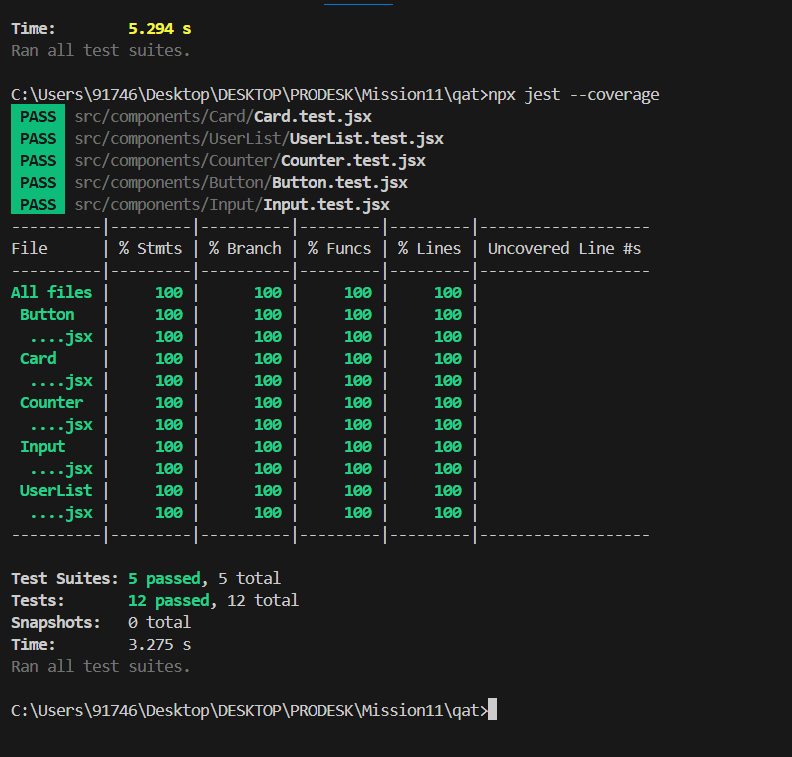

# QA Automation Testing Suite with Jest & React Testing Library

## Overview

This project demonstrates the implementation of a comprehensive automated testing framework for a Next.js application using **Jest** and **React Testing Library (RTL)**.

The objective of the project was to establish a reliable quality assurance workflow capable of validating component rendering, user interactions, asynchronous operations, and API integrations while maintaining measurable code coverage standards.

The testing suite was designed following modern frontend testing practices, ensuring that UI components behave correctly and regressions can be detected before deployment.

---

## Project Objectives

The project was developed to achieve the following goals:

* Configure Jest and React Testing Library in a Next.js environment.
* Establish a browser-like testing environment using jsdom.
* Implement unit tests for reusable UI components.
* Validate component rendering and prop handling.
* Test user interactions and state changes.
* Mock network requests for isolated and deterministic testing.
* Generate automated code coverage reports.
* Maintain code coverage above the required threshold.

---

## Features Implemented

### Unit Testing

Unit tests were created to verify that components render correctly and display the expected content based on provided props.

Components tested:

* Button
* Card
* Input

Testing coverage includes:

* Successful component rendering
* Prop-based content validation
* UI consistency verification

---

### Interaction & Event Testing

Interactive components were tested to ensure user actions correctly update application state and DOM output.

Components tested:

* Counter
* Input

Testing coverage includes:

* Click events
* State updates
* User input handling
* DOM re-rendering after interactions

---

### Asynchronous Testing & API Mocking

A dedicated UserList component was implemented to simulate real-world asynchronous data fetching.

The API layer was mocked to eliminate dependencies on external services and ensure consistent test execution across environments.

Testing scenarios include:

* Loading state
* Successful API response
* Error handling
* Empty response handling

This approach guarantees reliable and repeatable test results without requiring internet connectivity.

---

## Technology Stack

| Technology            | Purpose                        |
| --------------------- | ------------------------------ |
| Next.js               | React Framework                |
| React                 | UI Development                 |
| Jest                  | Test Runner                    |
| React Testing Library | Component Testing              |
| jest-dom              | Extended DOM Assertions        |
| user-event            | User Interaction Simulation    |
| jsdom                 | Browser Environment Simulation |

---

## Project Structure

```text
src/
├── components/
│   ├── Button/
│   ├── Card/
│   ├── Counter/
│   ├── Input/
│   └── UserList/
│
├── services/
│   └── api.js
│
├── __mocks__/
│   └── api.js
│
├── test-utils/
│   └── renderWithProviders.js
│
└── pages/
    └── index.jsx

jest.config.js
jest.setup.js
package.json
README.md
```

---

## Test Coverage

The test suite was configured to generate automated coverage reports and enforce minimum coverage thresholds.

### Final Coverage Results

| Metric     | Coverage |
| ---------- | -------- |
| Statements | 100%     |
| Branches   | 100%     |
| Functions  | 100%     |
| Lines      | 100%     |

All implemented components achieved complete test coverage.

---

## Test Results

```text
Test Suites: 5 passed, 5 total
Tests:       12 passed, 12 total
Snapshots:   0 total
```

---

## Running the Project

### Install Dependencies

```bash
npm install
```

### Start Development Server

```bash
npm run dev
```

### Run Tests

```bash
npm test
```

### Run Tests in Watch Mode

```bash
npm run test:watch
```

### Generate Coverage Report

```bash
npm run coverage
```

---

## Testing Strategy

The testing strategy follows a layered approach:

1. **Unit Testing** for individual component validation.
2. **Interaction Testing** for user-driven behavior verification.
3. **Asynchronous Testing** for API-dependent workflows.
4. **Mocking Strategy** to isolate components from external dependencies.
5. **Coverage Analysis** to measure test effectiveness and maintain quality standards.

This structure helps identify regressions early in the development lifecycle and supports maintainable, production-ready frontend applications.

---

## Key Outcomes

* Established a scalable frontend testing architecture.
* Implemented component-level and interaction-based testing.
* Mocked external API dependencies for deterministic test execution.
* Achieved 100% test coverage across all implemented components.
* Demonstrated modern QA automation practices within a Next.js application.

## snapshot



---

QA Automation Testing Project using Jest & React Testing Library
